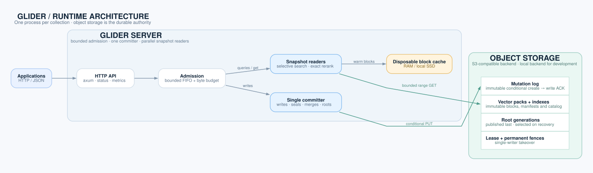

# Glider

[](https://github.com/omerfeyzioglu/glider/actions/workflows/ci.yml)
[](#license)

Glider is a single-node vector database with S3-compatible object storage as
its durable state. One `glider-server` process serves one collection, or
many collections created over HTTP, through an HTTP/JSON API. It supports writes, nearest-neighbor search and metadata filters;
local RAM and SSD accelerate reads but hold no acknowledged data exclusively.

## Quickstart

You need Docker and curl; **you do not need Rust installed locally**.

### Prebuilt image

Each release is published as a multi-platform image (`linux/amd64`,
`linux/arm64`). To try it with a local directory as storage:

```sh
docker run --rm -p 8080:8080 -e GLIDER_DIMENSIONS=3 \
  -e GLIDER_DATA_DIR=/var/lib/glider/data ghcr.io/omerfeyzioglu/glider:latest
```

Data in the container is lost when it stops; point it at S3 with the
[configuration](#configuration) variables to keep it. The write and query
examples below work against it as well.

### Docker Compose (with MinIO)

This setup also needs Git and builds the server from source. It uses local
MinIO and example credentials for a demo, not an internet-facing deployment.

```sh
git clone https://github.com/omerfeyzioglu/glider.git
cd glider
docker compose up --build -d
```

This starts MinIO, creates the `glider` bucket and serves collection `demo`
(3 dimensions, resident filter `color=red`) at `localhost:8080`. Once
`docker compose logs glider` shows `listening on 0.0.0.0:8080`, try a write
and a nearest-neighbor query:

```sh
curl -sS localhost:8080/v1/write -H 'content-type: application/json' \
  -d '{"upsert":[{"id":1,"vector":[0,0,0],"metadata":{"color":"red"}},{"id":2,"vector":[1,1,1]}]}'

curl -sS localhost:8080/v1/query -H 'content-type: application/json' \
  -d '{"vector":[1,1,0.9],"k":2,"include_metadata":true}'
```

The write returns a `sequence` and `request_id`; the query returns two hits
ordered by distance. Try an [exact query on `color=red`](docs/API.md#post-v1query),
[read a point](docs/API.md#get-v1pointsid), or inspect
[`/v1/status`](docs/API.md#get-v1status). Open
<http://localhost:8080/console> to explore the server in a browser.
`docker compose down` stops the demo
and keeps its data; `docker compose down -v` **deletes the demo data**.

For AWS, you must provision the bucket, compute host, networking, credentials
and TLS edge. See the [deployment architecture](docs/ARCHITECTURE.md#aws-deployment-pattern).

### From source

Requires Rust 1.98.1 (the version CI uses).

```sh
cargo build --release --features server --bin glider-server
GLIDER_DATA_DIR=./data GLIDER_DIMENSIONS=3 GLIDER_RESIDENT_FILTER=color=red \
  target/release/glider-server
```

`GLIDER_DATA_DIR` stores the collection in a local directory, which is
convenient for development. For S3, set `GLIDER_S3_BUCKET`,
`GLIDER_S3_NAMESPACE` and AWS credentials instead:

```sh
GLIDER_S3_BUCKET=my-bucket GLIDER_S3_NAMESPACE=collections/demo \
GLIDER_S3_REGION=eu-central-1 GLIDER_DIMENSIONS=3 \
AWS_ACCESS_KEY_ID=... AWS_SECRET_ACCESS_KEY=... \
  target/release/glider-server
```

## Key features

- **Durable on S3.** Every acknowledged write is part of an immutable log
  object published with a conditional create; nothing is overwritten in
  place, and local disks never hold the only copy.
- **Crash-safe takeover.** A restarted server waits out the old writer's
  lease, fences it at the object store and replays the log tail; a paused
  former owner can never commit again. No operator step after a crash.
- **Clustered ANN with automatic clustering.** Vectors are grouped into a
  global clustered view (centroids and cluster-contiguous postings) that the
  server builds by itself at 250,000 rows and rebuilds as the collection
  grows. Unfiltered queries read at most 8 remote ranges and 1 MiB.
- **SSD cache.** A local block cache is filled in the background so warm
  queries need no remote reads. Losing it does not lose acknowledged writes;
  it can affect query latency and approximate-search recall until warm again.
- **Collections.** One server creates, lists, deletes and serves many
  collections, each with its own dimension and metric in its own prefix;
  they open on first use and idle ones close beyond a configured limit.
- **Filters.** Equality, set, existence, numeric and logical filters on string
  metadata; one declared equality is answered exactly, and up to four declared
  keys steer routing. Exhaustive queries and scans accept every filter.
- **Metadata in results.** Queries can return each hit's metadata and
  vector.
- **Safe retries.** Every write carries a request ID; resending it returns
  the original outcome instead of applying the write twice.
- **Operations.** HTTP API, Docker image and Compose quickstart, Prometheus
  metrics, `glider-admin` for status, backup, restore and clustering.

## Status

Glider is a single-node database with one writer per collection. Its scope:

- one or many collections per server process, with one writer and lease per
  open collection;
- upsert, delete, get and k-NN query (squared Euclidean, Manhattan or
  cosine) with metadata filters, over HTTP or as a Rust library;
- validated up to 1,000,000 128-dimensional vectors on MinIO and on AWS S3
  ([performance](#performance)).

Known limitations:

- No replication, sharding, read replicas or standby; availability during a
  restart depends on the lease (default 10 s) and the open time.
- Default queries with filters other than the declared resident equality
  are approximate and may return fewer than `k` results. Use `exact:true`
  for an exhaustive answer.
- Peak memory at 1,000,000 vectors (235.6 MiB on MinIO, 257.9 MiB on AWS)
  is above the 192 MiB target.
- Opening a large collection on S3 takes seconds (3.15 s, and 4.00 s for a
  reopen, at 1,000,000 vectors), above the 2 s target.
- The dimension, metric, resident filter and routed keys are fixed when a
  collection is created.
- Plain HTTP with an optional static bearer token; terminate TLS in a
  reverse proxy.
- A point must fit in one 120 KiB storage block (vector plus metadata, about
  122,000 bytes); larger points are rejected with `400`
  ([limits](docs/API.md#post-v1write)).
- No built-in scheduled backups; use S3 Versioning and `glider-admin backup`.

## Configuration

`glider-server` and `glider-admin` read these environment variables (see
`ServerConfig::from_env` in `src/server/config.rs`). An invalid value stops
the server with an error. Set `GLIDER_DIMENSIONS`
for the existing single-collection mode. Leave it unset for multi-collection
mode and create collections through HTTP. In multi mode, also leave
`GLIDER_METRIC`, `GLIDER_RESIDENT_FILTER`, and `GLIDER_ROUTED_KEYS` unset; these
settings belong to each collection. **Use a base prefix in only one mode.** In
multi mode it contains `catalog/` and `data/`, not an engine namespace.

| Variable | Default | Meaning |
|---|---|---|
| `GLIDER_DIMENSIONS` | unset (multi mode) | Set a positive dimension for single-collection mode; unset selects multi-collection mode. |
| `GLIDER_METRIC` | `squared_euclidean` | `squared_euclidean`, `manhattan` or `cosine`. Fixed at creation. |
| `GLIDER_RESIDENT_FILTER` | unset | One `key=value` equality predicate answered exactly from vectors kept in memory. Fixed at creation. |
| `GLIDER_ROUTED_KEYS` | unset | Up to four comma-separated metadata keys whose values restrict query routing (sorted and deduplicated). Fixed at creation. |
| `GLIDER_DATA_DIR` | unset | Local base directory; when set, the S3 variables are ignored. |
| `GLIDER_S3_BUCKET` | required without `GLIDER_DATA_DIR` | Bucket name. |
| `GLIDER_S3_NAMESPACE` | required without `GLIDER_DATA_DIR` | Base key prefix owned by this server. Do not overlap prefixes or mix modes. |
| `GLIDER_S3_REGION` | `us-east-1` | Bucket region. |
| `GLIDER_S3_ENDPOINT` | unset | Endpoint for S3-compatible stores such as MinIO; an `http://` endpoint enables plain HTTP. |
| `AWS_ACCESS_KEY_ID`, `AWS_SECRET_ACCESS_KEY`, `AWS_SESSION_TOKEN` | unset | Credentials, read by the `object_store` S3 client (`AmazonS3Builder::from_env`). |
| `GLIDER_LISTEN` | `127.0.0.1:8080` | Listen address (`0.0.0.0:8080` in the Docker image). |
| `GLIDER_API_TOKEN` | unset | If set, required as `Authorization: Bearer <token>` on API routes except `/healthz` and `/metrics`. The public console prompts for the token. |
| `GLIDER_CONSOLE` | `1` | Serve the built-in web console at `/console`, with `/` redirecting there. Set `0` to disable both routes. The page is public; its API calls use the token entered in the page. |
| `GLIDER_LEASE_SECONDS` | `10` | Writer lease duration (fractions allowed). After a crash, the next start waits at most this long before taking over. |
| `GLIDER_CACHE_DIR` | `glider-cache` | Local block cache directory, relative to the working directory (`/var/lib/glider/cache` in the Docker image). Any local disk works: instance-store NVMe, EBS or a container volume. |
| `GLIDER_CACHE_BYTES` | `268435456` (256 MiB) | Local cache limit. While idle the server copies the collection into the cache up to this limit; set it above `cache.namespace_bytes` from `/v1/status` to keep everything local. |
| `GLIDER_MAX_OPEN_COLLECTIONS` | `64` | Maximum open collections in multi mode. Opening another closes the least recently used idle collection. Per-collection cache budget is `max(16 MiB, GLIDER_CACHE_BYTES / GLIDER_MAX_OPEN_COLLECTIONS)` under `<GLIDER_CACHE_DIR>/<name>-<generation>/`. |
| `GLIDER_LOCAL_BLOCKS` | `24` | Cached blocks a query may rerank in addition to its remote budget. `0` makes results independent of the cache contents. |
| `GLIDER_AUTO_CLUSTER_ROWS` | `250000` | Live sealed rows at which a collection without a clustered view is converted to one in the background. `0` disables. |
| `GLIDER_AUTO_RECLUSTER_FACTOR` | `4` | Rebuild the clustered view with more clusters once the collection holds more than this factor times the rows it was sized for (about 4,000 per cluster). `0` disables. |

The server uses the 1,000,000-row serving profile
(`SegmentedServingOptions::m31`): per query 12 candidate blocks, 8 remote
range requests and 1 MiB, 32 cluster probes, 8 routing threads; at most 4
concurrent queries; an admission queue of 8 commands and 1 MiB. These are
not configurable through the environment. Multi mode uses two concurrent
queries and two scoring threads per open collection; other serving settings
are shared. If all open collections have requests in flight, a new open
returns `429` until one becomes idle.

## HTTP API

With `GLIDER_DIMENSIONS` unset, use these collection routes. The data routes
in the table below move under `/v1/collections/{name}` with the same bodies,
responses and error rules. The unprefixed data routes return `404` in multi
mode; `/healthz` and `/metrics` remain global.

| Collection endpoint | Purpose |
|---|---|
| `POST /v1/collections` | Create from `{"name":"demo","dimensions":3,"metric":"squared_euclidean","resident_filter":{"key":"value"},"routed_keys":["key"]}`. Returns `201`, or `200` for the same configuration, `409` for a different one. |
| `GET /v1/collections` | Sorted descriptions with `open` state. |
| `GET /v1/collections/{name}` | Description and current `status` (opens lazily). |
| `DELETE /v1/collections/{name}` | Drain and release, delete the catalog entry, then clean its generation; `204` or `404`. |

Names must match `^[a-z0-9][a-z0-9-]{0,62}$`. `glider-admin` still requires
`GLIDER_DIMENSIONS` and operates on single-collection prefixes; collection
selection for admin commands is a follow-up.

| Endpoint | Purpose |
|---|---|
| [`POST /v1/write`](docs/API.md#post-v1write) | Atomic batch `{"upsert":[...],"delete":[...],"request_id":{...}}` (up to 100 operations); returns `sequence` and `request_id` |
| [`POST /v1/query`](docs/API.md#post-v1query) | `{"vector":[...],"k":10,"filter":{...},"exact":false,"include_metadata":false,"include_vector":false}` |
| [`POST /v1/points/get`](docs/API.md#post-v1pointsget) | Get 1 to 1000 IDs in one acknowledged view; optional vector and metadata fields |
| [`POST /v1/scan`](docs/API.md#post-v1scan) | Count and page through live points by [metadata filter](docs/API.md#filters) and ascending ID |
| [`GET /v1/points/{id}`](docs/API.md#get-v1pointsid) | Current vector and metadata, or `404` |
| [`GET /v1/requests/{boundary}/{nonce}`](docs/API.md#get-v1requestsboundarynonce) | Resolve a write whose response was lost |
| [`GET /v1/status`](docs/API.md#get-v1status) | Sequence, queue, cache warm-up and clustering state |
| [`GET /healthz`](docs/API.md#get-healthz) | Liveness (no auth) |
| [`GET /metrics`](docs/API.md#get-metrics) | Prometheus metrics (no auth) |

Errors are JSON `{"error": "..."}` with `400` for invalid input, `401`,
`404`, `409` for request-ID misuse, `429` when the queue is full (retry),
`500` for corruption and `503` when storage or the worker is unavailable.
See the [API reference](docs/API.md) for schemas, limits and retry rules.

A Python client needs nothing beyond `requests`:

```python
import requests, secrets

base = "http://localhost:8080"
# A client-chosen request ID makes the write safe to resend after a timeout.
boundary = requests.get(f"{base}/v1/status").json()["sequence"]
write = {
    "upsert": [{"id": 10, "vector": [0.5, 0.5, 0.5], "metadata": {"color": "red"}}],
    "request_id": {"boundary": boundary, "nonce": secrets.token_hex(16)},
}
print(requests.post(f"{base}/v1/write", json=write).json())

hits = requests.post(f"{base}/v1/query", json={
    "vector": [0.4, 0.5, 0.5], "k": 3, "filter": {"color": "red"},
    "include_metadata": True,
}).json()["results"]
for hit in hits:
    print(hit["id"], hit["distance"], hit["metadata"])
```

## Operations

- **While running:** [`GET /v1/status`](docs/API.md#get-v1status) shows the
  committed sequence, queue, cache and clustering state; [`/metrics`](docs/API.md#get-metrics)
  exposes Prometheus metrics.
- **After a crash:** restart on the same prefix with the same collection
  settings. The server waits for the writer lease, fences the old writer and
  replays acknowledged writes. Resolve a lost write response by its request
  ID ([recovery guide](docs/RECOVERY.md)).
- **Maintenance:** `glider-admin` provides `status`, `backup`, `restore` and
  `convert`. It needs exclusive access to the collection, so stop the server
  before running it. The Compose image includes the admin binary:

  ```sh
  docker compose stop glider
  docker compose run --rm --no-deps --entrypoint glider-admin glider status
  docker compose start glider
  ```

The [serving guide](docs/SERVING.md) covers backups, restores, clustering and
S3 Versioning. The local Compose demo does not schedule backups or provide
multi-node failover.

## Performance

Measured at 1,000,000 vectors of SIFT1M (128 dimensions, squared Euclidean,
k=10, 200 queries) under the M31 workload: load in 100-row batches, then
300 s of four writers each overwriting 100 rows per second and four readers
each querying every 100 ms, then restart, cache-loss and backup checks. Both
runs use the clustered view (explicit conversion, 32 probes); the MinIO run
predates automatic clustering and root manifests.

| Measure | MinIO, Apple M4 ([M37](benchmarks/M37.md#1m-minio-acceptance-on-the-clustered-view), `a636045`) | AWS S3 Standard, c7g.2xlarge ([M39](benchmarks/M39.md#root-manifests-and-fast-open-on-s3), `9e2f602`) | Target |
|---|---:|---:|---:|
| Static recall@10 (mean / p5) | 0.998 / 1.0 | 0.998 / 1.0 | >=0.90 / >=0.80 |
| Recall@10 after updates, cold (mean / p5) | 0.963 / 0.8 | 0.963 / 0.8 | >=0.90 / >=0.80 |
| Warm unfiltered query p95 | 36.6 ms | 30.9 ms | <=50 ms |
| Cold unfiltered query p95 | 33.7 ms | 58.6 ms | <=200 ms |
| Write p95 | 33.0 ms | 97.6 ms | <=150 ms |
| Open / reopen | 1.43 / 1.73 s | 3.15 / 4.00 s | <=2 s |
| Peak engine RSS | 235.6 MiB | 257.9 MiB | <=192 MiB |

MinIO ran on loopback on an Apple M4 (10 cores, 16 GiB). The AWS run used a
c7g.2xlarge (8 Graviton3 vCPU, 16 GiB) in eu-central-1 against S3 Standard;
its filtered (resident 1%) query p95 was 10.6 ms, and it lost no
acknowledged writes and returned equal results after cache loss and backup
restore. Datasets, seeds, raw
results and the remaining measurements are in [BENCHMARKS.md](BENCHMARKS.md)
and [benchmarks/](benchmarks/SUMMARY.md).

## Architecture



- A write batch becomes one immutable log object, created conditionally,
  before it is acknowledged.
- Idle maintenance seals the log tail into immutable packs of vector-local
  blocks with compact five-bit sketches, and publishes each new state as a
  root generation that references per-run manifests.
- The clustered view assigns rows to centroids so a query reads only the
  nearest clusters' blocks; new seals keep it clustered and small extents
  are merged in the background.
- Takeover uses a renewed lease to pace restarts and permanent fence objects
  so that a deposed writer's next publication fails at the store.

The [architecture guide](docs/ARCHITECTURE.md) includes an AWS deployment
diagram. [DESIGN.md](DESIGN.md) states the formats, invariants, and crash and
recovery semantics in full.

## Python client and agent memory

[`clients/python`](clients/python/README.md) is a dependency-free Python
client for the whole HTTP API, with safe write retries, paging scans, count,
delete-by-filter and collection management (`create_collection`,
`client.collection(name)`). Its optional MCP server gives AI agents (Claude
Code, Claude Desktop, Cursor and other MCP clients) durable `remember`,
`recall` and `forget` tools backed by Glider. Run the server in
multi-collection mode (no `GLIDER_DIMENSIONS`); the MCP server creates its
collection, sized for the embedding model, on first use:

```sh
docker run -d --name glider -p 8080:8080 -v glider-data:/var/lib/glider \
  -e GLIDER_DATA_DIR=/var/lib/glider/data ghcr.io/omerfeyzioglu/glider:latest
pip install "glider-client[mcp] @ git+https://github.com/omerfeyzioglu/glider#subdirectory=clients/python"
claude mcp add glider -e GLIDER_COLLECTION=memory -- glider-mcp
```

## Library

The crate can also be used directly from Rust, including the resident
in-memory `Database` engine and the segmented engine behind the server. See
the [library guide](docs/LIBRARY.md).

## Development

Checks that CI runs:

```sh
cargo fmt --check
cargo clippy --all-targets --locked -- -D warnings
cargo clippy --all-targets --all-features --locked -- -D warnings
cargo test --release --locked
cargo test --release --all-features --locked
python3 -m unittest discover -s tests -p 'test_*.py'
python3 tools/benchmarks.py summary --check
python3 tools/benchmarks.py summary --archive benchmarks/filtering --check
python3 tools/check_links.py
```

Object-store integration tests run against a disposable, pinned MinIO
container (requires Docker and Python 3):

```sh
python3 tools/test_s3.py
python3 tools/quickstart_smoke.py
```

Local failure drills: `python3 tools/drills.py --seed 29`. Benchmarks and
acceptance runs (`tools/m24_acceptance.py` on MinIO, `tools/aws_acceptance.py`
on EC2 and S3) are described in [BENCHMARKS.md](BENCHMARKS.md). See
[CONTRIBUTING.md](CONTRIBUTING.md) for the workflow.

## Documentation

| Document | Contents |
|---|---|
| [docs/API.md](docs/API.md) | HTTP API reference |
| [docs/LIBRARY.md](docs/LIBRARY.md) | Rust library guide |
| [docs/RECOVERY.md](docs/RECOVERY.md) | Crash, takeover and restore procedures |
| [docs/SERVING.md](docs/SERVING.md) | Server operations and resident-library serving envelope |
| [docs/ARCHITECTURE.md](docs/ARCHITECTURE.md) | Runtime and AWS deployment diagrams |
| [DESIGN.md](DESIGN.md) | Architecture, formats and guarantees |
| [docs/CLUSTERED_INDEX.md](docs/CLUSTERED_INDEX.md) | Clustered index design |
| [ROADMAP.md](ROADMAP.md) | Milestones and next work |
| [BENCHMARKS.md](BENCHMARKS.md), [benchmarks/SUMMARY.md](benchmarks/SUMMARY.md) | Measurements and how to reproduce them |
| [CHANGELOG.md](CHANGELOG.md) | Release notes |
| [CONTRIBUTING.md](CONTRIBUTING.md) | Development workflow |
| [SECURITY.md](SECURITY.md) | Reporting vulnerabilities and deployment security |
| [docs/EVOLUTION.md](docs/EVOLUTION.md) | History of major decisions |

## License

Licensed under either of [Apache License, Version 2.0](LICENSE-APACHE) or
[MIT license](LICENSE-MIT) at your option. Unless you explicitly state
otherwise, any contribution intentionally submitted for inclusion in this
project, as defined in the Apache-2.0 license, shall be dual licensed as
above, without any additional terms or conditions.
