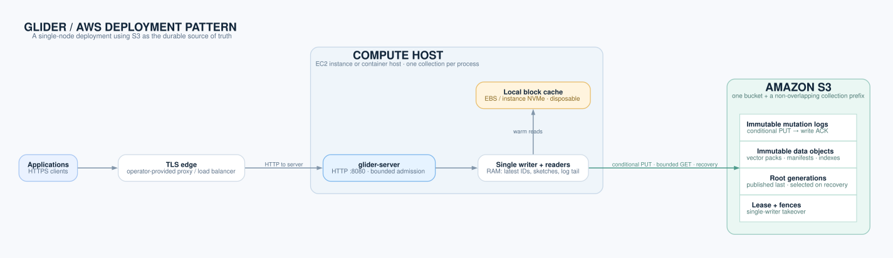

# Architecture

Glider runs one collection per `glider-server` process. The server keeps
routing state in memory and may cache vector blocks on local storage. The
object store is the durable authority: replacing the process or clearing its
cache does not discard acknowledged writes.

## Runtime


The diagram shows the main request paths; these steps explain the storage
objects listed on its right:

- **Write:** bounded admission → single committer → conditional creation of
  one complete mutation-log object → acknowledgement.
- **Maintenance:** create immutable packs, indexes and manifests, then publish
  the root generation that names them. Data objects precede the root.
- **Read:** up to four reader threads use a published snapshot to route to
  blocks, read bounded object-store ranges or cached blocks, and rerank full
  vectors. The unsealed log tail also participates.
- **Restart:** wait for the writer lease, publish permanent fences, select a
  complete root and replay the contiguous newer log tail. An earlier writer
  cannot publish after takeover.

Exact kNN is the reference for approximate search. A cold cache can change
latency and approximate recall, but not acknowledged state. See
[DESIGN.md](../DESIGN.md) for format versions, publication and recovery rules.

## AWS deployment pattern



This is a deployment pattern for the existing single-node server, not
infrastructure shipped by the repository. An Application Load Balancer
terminates HTTPS; one private-subnet EC2 instance runs one `glider-server`
process for one collection. An S3 gateway endpoint connects it to the bucket,
where logs, packs, roots and writer ownership objects are durable. EBS holds
only a disposable cache. Give each collection a distinct S3 namespace prefix.

Provision the VPC, load balancer, compute host, endpoint, bucket, credentials,
monitoring and backups. Configure bearer-token authentication and TLS at the
edge before exposing the service. Monitor [`/healthz`](API.md#get-healthz),
[`/metrics`](API.md#get-metrics) and [`/v1/status`](API.md#get-v1status);
the [serving guide](SERVING.md) covers backup and recovery. There is one active
server and no built-in standby. The repository does not ship an AWS deployment
template or a published prebuilt image. The [Compose quickstart](../README.md#quickstart)
is a local demo; [configuration](../README.md#configuration) lists the S3
variables.

## Diagram sources

The editable [runtime](architecture/runtime.drawio) and
[AWS](architecture/aws.drawio) sources open in
[diagrams.net](https://app.diagrams.net/). Export each page as SVG with
embedded images to update the corresponding image in this directory. Then
inline the icon paths for GitHub's SVG content policy:

```sh
python3 docs/architecture/flatten_svg_icons.py docs/architecture/runtime.svg docs/architecture/aws.svg
```

The AWS diagram uses the official
[AWS Architecture Icons](https://aws.amazon.com/architecture/icons/) package
(July 2026 release). Generic runtime icons are from
[Lucide](https://lucide.dev/) under its
[ISC license](architecture/LUCIDE-LICENSE.txt).
